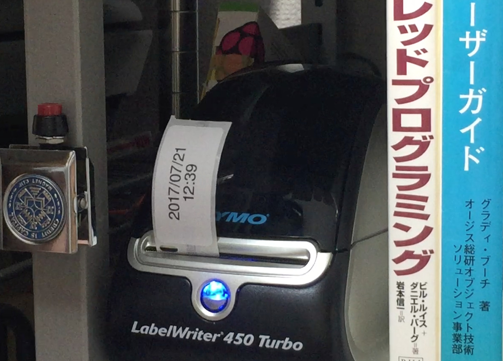

# Raspberry Pi Dymo LabelWriter (R) Timestamp Printer

## Disclaimer

This software is provided as-is.  Currently, these files are only
materials we can provide.  I can't ensure if I can answer to your
questions promptly.



## YouTube

- https://www.youtube.com/watch?v=e1wjYJmdkJ8

## Blog (originally Japanese but translated to English by Google)

- [(Translated by Google) I tried to make a timestamp (date) printer with Raspberry Pi](https://translate.google.com/translate?hl=en&sl=auto&tl=en&u=https%3A%2F%2Fflogics.com%2Fwp%2Fja%2F2017%2F07%2Fraspberry-pi-%25E3%2581%25A7%25E3%2580%2581%25E3%2582%25BF%25E3%2582%25A4%25E3%2583%25A0%25E3%2582%25B9%25E3%2582%25BF%25E3%2583%25B3%25E3%2583%2597%25EF%25BC%2588%25E6%2597%25A5%25E4%25BB%2598%25EF%25BC%2589%25E3%2583%2597%25E3%2583%25AA%25E3%2583%25B3%25E3%2582%25BF%25E3%2582%2592%25E4%25BD%259C%25E3%2581%25A3%2F)

- [(Translated by Google) Next, I tried to create a timestamp (date) printer with Raspberry Pi](https://translate.google.com/translate?hl=en&sl=auto&tl=en&u=https%3A%2F%2Fflogics.com%2Fwp%2Fja%2F2017%2F07%2F%25e7%25b6%259a%25e3%2583%25bbraspberry-pi-%25e3%2581%25a7%25e3%2580%2581%25e3%2582%25bf%25e3%2582%25a4%25e3%2583%25a0%25e3%2582%25b9%25e3%2582%25bf%25e3%2583%25b3%25e3%2583%2597%25ef%25bc%2588%25e6%2597%25a5%25e4%25bb%2598%25ef%25bc%2589%25e3%2583%2597%25e3%2583%25aa%25e3%2583%25b3%25e3%2582%25bf%25e3%2582%2592%2F)

## Files Explanation

### [rpi](./rpi)

Raspberry Pi software written by Shell scripting language are located
in ```bin/``` directory.

- ```printdatetime_server```: Label printing server which should be
  running all along.
  
- ```printdatetime```: Test program to print a timestamp label.  (Not
  required usually.)
  
- ```start_printdatetime_server```: Monitor program which should be
  periodically ran by cron etc.
  
- ```gen_datetime_label```: Sub-program, to generate label image,
  which is called by ```printdatetime_server```.

- ```lpr_datetime_label```: Sub-program, to print label image, which
  is called by ```printdatetime_server```.

### [etc](./etc)

Some (possibly) helpful files.  (I forgot how helpful.)

### [examples](./examples)

Some examples.

## Some Note

- Dymo Linux driver can be downloaded
  [here](http://www.dymo.com/en-US/dymo-label-sdk-and-cups-drivers-for-linux-dymo-label-sdk-cups-linux-p--1).

- [This tutorial](http://www.penguintutor.com/linux/printing-cups) is
  quite helpful to understand how to set-up Dymo printer for Raspberry
  Pi.

- You need to obtain a font file by a legal way.

- You may need to install some software packages (e.g. ImageMagick).

- You can attach a button switch to start printing.  The GPIO number,
  which is connected to the switch, is defined by ```PORT``` in
  ```printdatetime_server```.  Please also refer tutorials like
  [this](https://sites.google.com/site/semilleroadt/raspberry-pi-tutorials/gpio).

- You can utilize more sophisticated library to monitor GPIO.

- If you want, please freely fork this Git repo. :)

Atsushi Yokoyama, Firmlogics

https://flogics.com/
